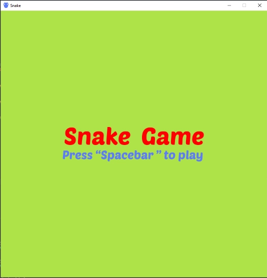
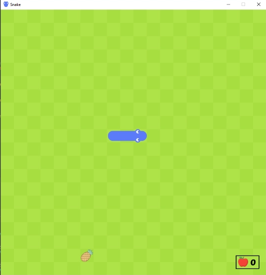
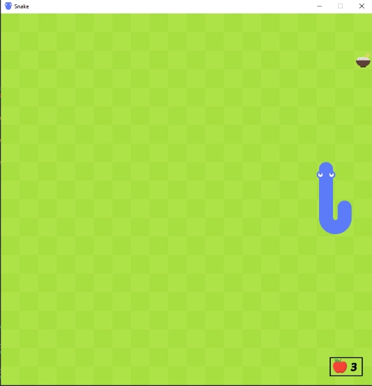
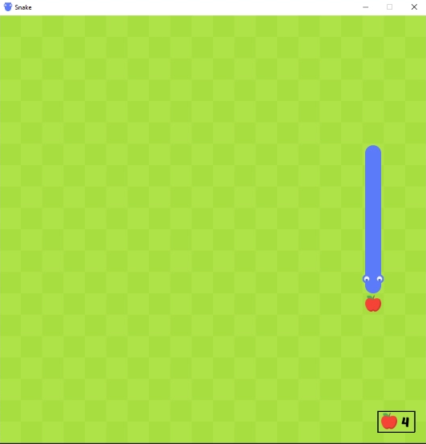
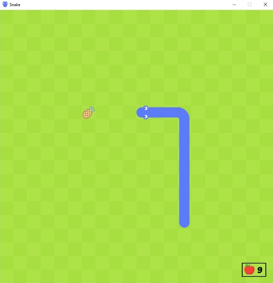

# 🎮 Snake-game-using-Python
I made a Snake game using the pygame module Python

## `How to play`

1. Open the "main.py" file using your IDE
2. Run the Code
3. Play

## `Controls`

1. Press "Spacebar" to Start the Game
2. Press "W", "A", "S", "D" or "Left Arrow Key", "Right Arrow Key",  "Up Arrow Key", "Down Arrow Key" keys to Control the Snake
3. Press "Spacebar" to Restart the Game after the Game is Over

## `Screenshots`

